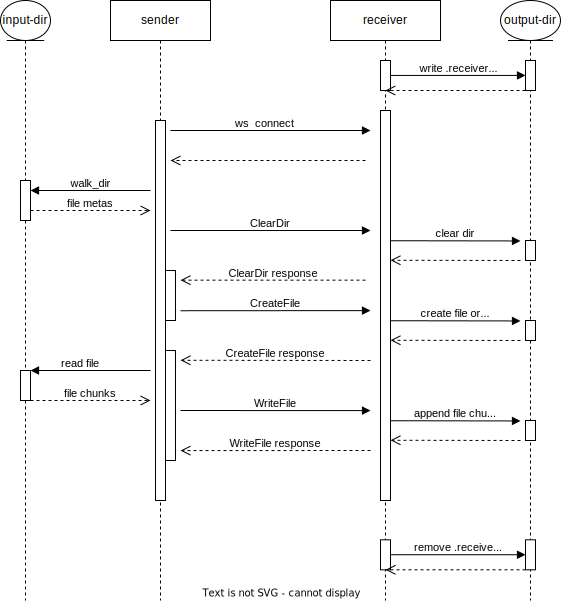

# tabby-interview

The interview question is described [here](https://github.com/TabbyML/interview-questions/tree/main/301_sync_directory_over_websocket).

## Get Started

### development environment

`rustup show`:

```
active toolchain
----------------

stable-x86_64-pc-windows-msvc (default)
rustc 1.72.0 (5680fa18f 2023-08-23)
```

### build

After pulling current project [repo](https://github.com/darknight/tabby-interview.git)

```bash
cd tabby-interview
cargo build
```

### run receiver

After build, the executable file `.\target\debug\sync-directory.exe` will be generated.

```bash
.\target\debug\sync-directory.exe --port 9000 --output-dir .\recv_dir
```

The `recv_dir` will be created under the current directory (project root, e.g. `.\tabby-interview`)
if it doesn't exist.

### run sender

After receiver is running up, open another shell, and run

```bash
.\target\debug\sync-directory.exe --to ws://localhost:9000 --from .\crates
```

This will sync all the contents in `.\crates`(actually the source codes in this project) to `.\recv_dir`.

### run unit tests

```bash
cargo test --workspace
```

## Design Decision

### Implement the "sync" semantic

This is one of the minimum requirements. The method I've used to implement this is a bit of brute force.

Before syncing, I'll clean up receiver's directory first, then send all the files from sender to receiver.

I understand this is not most efficient way, but it allows me to iterate quickly.

In `Send with deduplication` section, I mentioned a better way to do this.

### Directory syncing should be performed recursively

This is another minimum requirement.

By saying `recursively`, my understanding is that we want to sync all the files in the directory and its subdirectories and so on.

It's **NOT** related to implementation details. Based on what I know, Rust doesn't support tail recursion optimization officially ([only as experimental feature](https://github.com/rust-lang/rust/issues/112788)), which means there's a risk for recursive traversing to get stack overflow if the directory is too deep. So it's better not use recursion in the implementation.

Luckily, there is a well-maintained library [walkdir](https://docs.rs/walkdir/latest/walkdir/index.html) which can help us to do the job.

### Only one sender connection

This is a reasonable decision, since we expect the receiver's directory is the same as the sender's one.

If there are two senders sending files, this will cause data corruption.

Fortunately, `tokio` provide async version of `Semaphore` to help us.

In receiver implementation, before accepting a new connection, we acquire a permit from the semaphore, subsequent connection will be waiting for the permit to be released.

### Message ordering

On sender side, for large files, we split file into chunks.

In order to be able to re-create the file on receiver side, we need to make sure the chunks are sent in order.

From `tokio::sync::mpsc::channel` documentation, it says:

```
All data sent on Sender will become available on Receiver in the same order as it was sent.
```

As for the network transmission, websocket relies on TCP, and TCP is a stream-oriented protocol.

So as long as there's no proxy or middleman to re-order the data, we can assume that the data will be received in order.

So the file **append** operation on receiver side is safe.

### Send large files

For large files, if we load the whole file into memory, then send it. It will consume too much memory and probably cause OOM.

To make program more efficient and stable, we split the file into chunks, then send them separately.

Based on the explanation of message ordering, we can assume that the chunks will be received in order.

So on receiver side, what we need to do is open the file in append mode, then write the chunks.

### PID file in receiver's directory

To make sure there's only one receiver running for specified output directory, we create a PID file in that directory.

When receiver starts, it will check if the PID file exists, if it does, which means there might be another receiver using current directory, this program will exist.

### Graceful shutdown

To quit receiver gracefully, we listen to `SIGINT` signal, `tokio` has built-in support for this.

When receiver quits, it will remove the PID file generated when it starts.

### Symbolic links

Symbolic links are skipped during syncing.

## Architecture

### Layered Design

Both sender and receiver are implemented in a layered design.

- The top layer is the entity exposed to the user, which is the `Sender` and `Receiver` struct.
- The middle layer is the handler which process application logic.
- The bottom layer is the transport layer, which is the websocket connection.

### Project Structure

The project contains four crates:

- `ws-cli`: implementation for `sync-directory` command
- `ws-common`: common code shared by other crates
- `ws-receiver`: implementation for receiver
- `ws-sender`: implementation for sender

### Sequence Diagram

Below is a rough sequence diagram for the program, to help understand how the program works.



## Limitations & Improvement

I understand that the current implementation is far from perfect, there're still a lot of things to improve.

To name a few I think are important:

### Write completion notification

Currently, when sender is done syncing, it won't exist but keep the connection alive.

One way is to count the number of file entries sent, and return from the tokio tasks when all the entries are sent.

Due to time limit, I didn't implement this.

### Reduce IO calls

Currently, when receiver receives a file entry, it will open the file in append mode, write the data. After the write, the file is closed.

Actually, we can keep the file open until the final file entry is written. This can improve the performance significantly for the large files.

### Action on IO error

Currently, file IO error are just logged, and the program continues.

We need to take care of this, and make sure the program can recover from IO error.

For example, if file write fails, should we retry? If so, how to do that?

### Concurrent write on receiver side

Currently, the receiver has the pattern:

- `read message from websocket -> process message -> send process result to websocket`

The next read has be to waited until the previous `process-send` is done.

Actually, it's not necessary, especially when writing different files.

We can make the file write concurrently on receiver side, just like concurrent read on sender side.

This may require more effort to implement, but it's definitely worth it.

### Logging & Tracing & Metrics

I understand these are essential for production program.

Luckily, Rust ecosystem has good support for these.

For example:

- https://github.com/rust-lang/log
- https://github.com/tokio-rs/tracing
- https://github.com/tikv/rust-prometheus

### Integration test

Async, IO-intensive program is difficult to write unit test, the functions are side effect, and the execution order is not deterministic. And we need to mock a lot of things, like network connection, filesystem etc.

So I think integration test is more suitable, and necessary.

### Send with deduplication

Currently, when sender is connected to the receiver, it first sends a `ClearDir` message to ask receiver to clear the directory.

This is inefficient when two sides are almost the same, in this case the sender has to send all the files again, which wastes bandwidth and receiver's resources.

To mitigate this, we can walk through the source, compute the checksum for each file, then send the file meta info together with checksum. On receiver side, we compare the checksum, if it's the same, then we skip the file. The receiver sends back the response with file list info which need to be synced.

Current implementation has extension design to support this, but I didn't fully implement it due to time limit.

### Message serialization format & compression

- Use more performant message serialization format (for example, protobuf)

- Compress text message (for example, gzip)

### Other improvements

- Add command line argument to control `log level`, `log destination`, `max current read/write`, `overwrite option` etc.

- Increase test coverage

- Sanitize file path (dir/./subdir/../ -> dir/)
