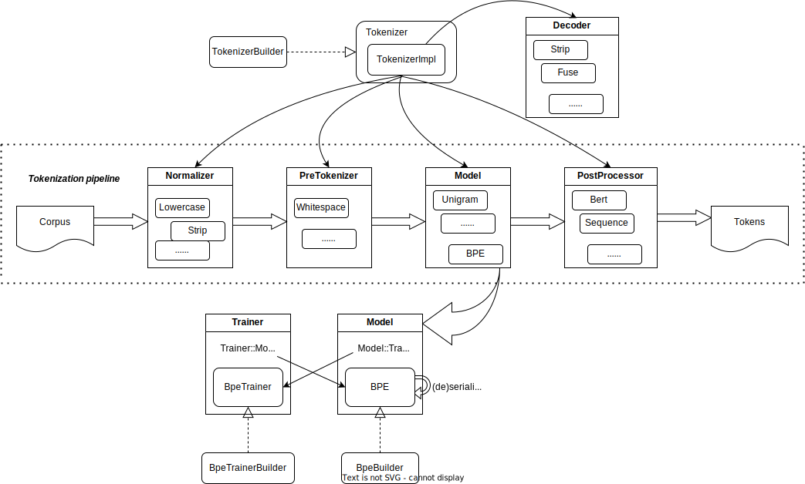
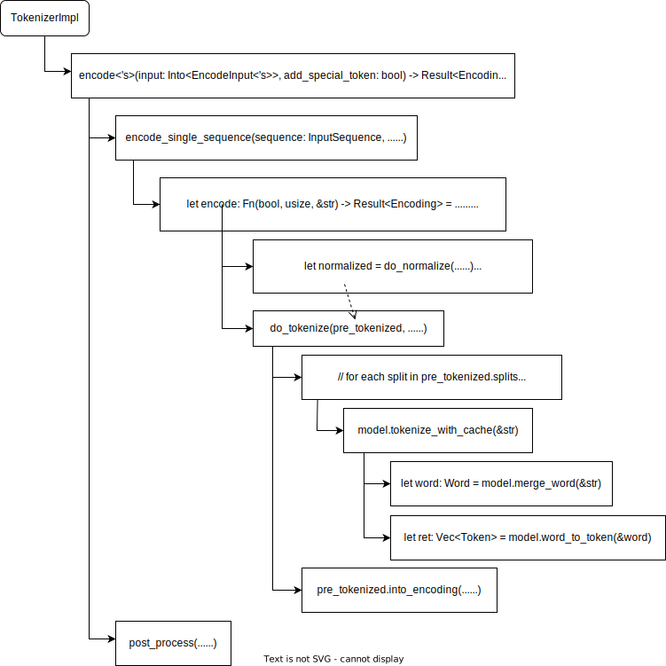

- [Introduction](#introduction)
- [First of all, what is a tokenizer anyway?](#first-of-all-what-is-a-tokenizer-anyway)
  - [Tokenization pipeline](#tokenization-pipeline)
    - [Normalization](#normalization)
    - [Pre-tokenization](#pre-tokenization)
    - [Model](#model)
    - [Postprocessor](#postprocessor)
- [Ok, I get it, then what is BPE?](#ok-i-get-it-then-what-is-bpe)
  - [The training algorithm](#the-training-algorithm)
  - [The tokenization algorithm](#the-tokenization-algorithm)
- [Show me the code](#show-me-the-code)
  - [High level overview](#high-level-overview)
  - [The training algorithm implementation](#the-training-algorithm-implementation)
    - [Calling chain for training](#calling-chain-for-training)
    - [Feed](#feed)
    - [Train](#train)
  - [The tokenization algorithm implementation](#the-tokenization-algorithm-implementation)
    - [Calling chain for tokenization](#calling-chain-for-tokenization)
- [Summary](#summary)

# Introduction

In this document, I'll talk about BPE tokenizer, more specifically:

- How it works
- How it is implemented in the [huggingface/tokenizers](https://github.com/huggingface/tokenizers) library

# First of all, what is a tokenizer anyway?

A tokenizer is a tool that splits a string into a list of tokens. There are many different kinds of tokenizers. For example, there are word tokenizers, character tokenizers, and subword tokenizers.

Word tokenizers split a string into a list of words. For example, the sentence "Hello world!" can be tokenized into ["Hello", "world", "!"].

Character tokenizers split a string into a list of characters. So the same sentence "Hello world!" will be tokenized into ["H", "e", "l", "l", "o", " ", "w", "o", "r", "l", "d", "!"].

Subword tokenizers split a string into a list of subwords. For example, "Hello world!" might be tokenized into ["He", "ll", "o", " ", "wo", "r", "ld", "!"].

Subword tokenizers are the most popular kind of tokenizers. They are used by many NLP models, including BERT, GPT, and GPT-2.

**BPE** is a subword tokenization algorithm, We'll focus on it in this document.

## Tokenization pipeline

When we do tokenizing, the input text will go through a pipeline. Here’s a high-level overview from hugging face [NLP Course](https://huggingface.co/learn/nlp-course/chapter6/4).


### Normalization

Normalization is, in a nutshell, a set of operations you apply to a raw string to make it less random or “cleaner”. Common operations include stripping whitespace, removing accented characters or lowercasing all text.

Multiple operations can be combined then applied to the raw text. For example, we can first strip the whitespace, then lowercase the text, and finally remove the accented characters, etc.

### Pre-tokenization

Pre-tokenization is the act of splitting a text into smaller objects that give an upper bound to what your tokens will be at the end of training. A good way to think of this is that the pre-tokenizer will split your text into “words” and then, those words will be the boundaries of tokens. The final tokens you get will be parts of those words.

### Model

The model is the core of a tokenizer. It's the place to split your “words” into tokens by using the rules it has learned. Some model is also responsible for mapping tokens to IDs which exist in the vocabulary of the model.

Model usually requires a training step first, which is to learn the rules that split the words into tokens. After the training the model can be used to tokenize a string.

In summary, in order to have a working tokenizer, we need:

1. pick up a tokenization algorithms (BPE, WordPiece, etc.)
2. train the model on some corpus
3. use the trained tokenizer to tokenize a string (i.e. `encoding`)
4. (optional) decode tokens back to the string

By the way, the `huggingface/tokenizers` supports loading **pretrained** tokenizer from file, which means we can skip the training step. But that's another story, we won't cover it in this document.

### Postprocessor

Post-processing is the last step of the tokenization pipeline, to perform any additional transformation to the final result before it’s returned, like adding potential special tokens (like `[CLS]` and `[SEP]` shown in the diagram above).

# Ok, I get it, then what is BPE?

BPE stands for **Byte-Pair-Encoding** ([paper](https://arxiv.org/abs/1508.07909)). It was initially developed as an algorithm to compress texts, and then used by OpenAI for tokenization when pretraining the GPT model. It’s used by a lot of Transformer models, including GPT, GPT-2, RoBERTa, BART, and DeBERTa. It's one of the most popular subword tokenization algorithm nowadays.

The Byte-Pair-Encoding works by starting with characters, while merging those that are the most frequently seen together, thus creating new tokens. It then works iteratively to build new tokens out of the most frequent pairs it sees in a corpus. BPE is able to build words it has never seen by using multiple subword tokens, and thus requires smaller vocabularies, with fewer chances of having “unk” (unknown) tokens.

## The training algorithm

As we mentioned earlier, to have a functional tokenizer, we need to train the model on some corpus. BEP requires training before its usage.

BPE training starts by computing the unique set of words used in the corpus (after normalization and pre-tokenization), then building the vocabulary by taking all the symbols used to write those words.

Let's use an example (taken from [NL Course](https://huggingface.co/learn/nlp-course/chapter6/5)) to explain how it works.

```
["hug", "pug", "pun", "bun", "hugs"]
```

The base `vocabulary` will then be ["b", "g", "h", "n", "p", "s", "u"]

After getting this base vocabulary, we start learning `merges`, which are pairs of symbols that will be merged together to create a new symbol. The algorithm starts with the base vocabulary, and then iteratively merges the most frequent pair of symbols together, until the desired vocabulary size is reached.

Going back to our previous example, let’s assume the words had the following frequencies:

```
("hug", 10), ("pug", 5), ("pun", 12), ("bun", 4), ("hugs", 5)
```

We start by splitting each word into characters, which we'll have

```
("h" "u" "g", 10), ("p" "u" "g", 5), ("p" "u" "n", 12), ("b" "u" "n", 4), ("h" "u" "g" "s", 5)
```

We look at pairs, for example, "hug" will produce ("h", "u"), ("u", "g"), "pug" will produce ("p", "u"), ("u", "g"), etc.

The most frequent pair is ("u", "g"), which is present total of 20 times. Thus, the first merge rule learned by the tokenizer is ("u", "g") -> "ug", which means that "ug" will be added to the vocabulary, and the pair should be merged in all the words of the corpus. At the end of this stage, the vocabulary and corpus look like this:

```
Vocabulary: ["b", "g", "h", "n", "p", "s", "u", "ug"]
Corpus: ("h" "ug", 10), ("p" "ug", 5), ("p" "u" "n", 12), ("b" "u" "n", 4), ("h" "ug" "s", 5)
Merges: ("u", "g") -> "ug"
```

We keep looking for the most frequent pair, and we find ("u", "n"), which is present 16 times. So the second merge rule learned is ("u", "n") -> "un", which leads us to

```
Vocabulary: ["b", "g", "h", "n", "p", "s", "u", "ug", "un"]
Corpus: ("h" "ug", 10), ("p" "ug", 5), ("p" "un", 12), ("b" "un", 4), ("h" "ug" "s", 5)
Merges: ("u", "g") -> "ug", ("u", "n") -> "un"
```

The next most frequent pair is ("h", "ug"), so we learn the merge rule ("h", "ug") -> "hug", which gives us:

```
Vocabulary: ["b", "g", "h", "n", "p", "s", "u", "ug", "un", "hug"]
Corpus: ("hug", 10), ("p" "ug", 5), ("p" "un", 12), ("b" "un", 4), ("hug" "s", 5)
Merges: ("u", "g") -> "ug", ("u", "n") -> "un", ("h", "ug") -> "hug"
```

We continue like this until we reach the desired vocabulary size.

## The tokenization algorithm

Tokenization process is similar to the training process, except that instead of learning the merge rules, we apply them. The outlined steps are:

1. Normalization

2. Pre-tokenization

3. Splitting the words into individual characters

4. Applying the merge rules learned on those splits

Let's reuse the example from the training section:

```
Vocabulary: ["b", "g", "h", "n", "p", "s", "u", "ug", "un", "hug"]
Corpus: ("hug", 10), ("pug", 5), ("pun", 12), ("bun", 4), ("hugs", 5)
Merges: ("u", "g") -> "ug", ("u", "n") -> "un", ("h", "ug") -> "hug"
```

If we tokenize the word `bug`, first we split it into characters, which give us ["b", "u", "g"], then we check if there is any merge rule can be applied, and we have `("u", "g") -> "ug"`. So in the end "bug" will be tokenized as ["b", "ug"].

`mug`, however, will be tokenized as ["[UNK]", "ug"] since the letter "m" was not in the base vocabulary.

Likewise, the word `thug` will be tokenized as ["[UNK]", "hug"]: the letter "t" is not in the base vocabulary. For the characters ("h", "u", "g"), first we apply the merge rule ("u", "g") -> "ug" to get ("h", "ug"), then we apply the merge rule ("h", "ug") -> "hug" to get "hug" as the final token.

Be aware that if there are multiple merge rules can be applied, we always pick the one with the highest ranking (i.e. most frequent pair).

# Show me the code

Now we have all the knowledge in mind, let's see how they are applied in the `huggingface/tokenizers` library.

## High level overview

Nothing better than a diagram can help us understand the code structure in a top-down way.

Here is the high level overview of library itself.



Each step in the pipeline is defined as a `pub trait`, and there are different implementations for each step. The `Tokenizer` object wraps `TokenizerImpl` object, which groups all the steps together.

The relevant definitions are:

```rust
pub struct Tokenizer(
    TokenizerImpl<
        ModelWrapper,
        NormalizerWrapper,
        PreTokenizerWrapper,
        PostProcessorWrapper,
        DecoderWrapper,
    >,
);
pub struct TokenizerImpl<M, N, PT, PP, D> {
    // Tokenizer parts
    normalizer: Option<N>,
    pre_tokenizer: Option<PT>,
    model: M,
    post_processor: Option<PP>,
    decoder: Option<D>,

    // other fields
    ......
}
impl<M, N, PT, PP, D> TokenizerImpl<M, N, PT, PP, D>
where
    M: Model,
    N: Normalizer,
    PT: PreTokenizer,
    PP: PostProcessor,
    D: Decoder,
{ ...... }
```

The `Decoder` trait is used to decode the tokens back to the original string, it's a separate functionality instead of a part of the pipeline.

From the diagram we can see, the library applies `builder` design pattern extensively, which provides flexibilities to users to customize the tokenizer and underlying model.

We won't cover all the components but only focus on `Model` part and see how it implements the BPE algorithm.

## The training algorithm implementation

Let's dive into the code and see how the BPE training algorithm is implemented.

### Calling chain for training



From the calling chain we can see, there are two important method calls: `feed` & `train`.

### Feed

The responsibility of `feed` is to calculate all the occurrences of each word for the given input (after normalization and pre-tokenization). Then save the result to `words` field of `BpeTrainer`.

```rust
pub struct BpeTrainer {
    words: HashMap<String, u32>,
    ...
}
```

Let's use an example to demonstrate the training process. Suppose the corpus is `vec!["hug bug hug bug bug"]`, after feeding, we'll have:

```rust
words:
    "hug" -> 2
    "bug" -> 3
```

The `feed` implementation also supports parallel processing, which is enabled by default. It uses the popular `rayon` library to do the job.

### Train

The `train` method is just wrapper of `BpeTrainer::do_train` method, which does all the heavy work inside.

There are 2 core data structures used in the `do_train` method:

```rust
let mut word_to_id: HashMap<String, u32> = HashMap::with_capacity(self.vocab_size);
let mut id_to_word: Vec<String> = Vec::with_capacity(self.vocab_size);
```

`word_to_id` is used to keep every token we've seen, and `id_to_word` is used to allocate next token id for new token, they're updated together as a group:

```rust
let s: String = // some new token
if !word_to_id.contains_key(&s) {
    id_to_word.push(s.clone());
    word_to_id.insert(s, (id_to_word.len() - 1) as u32);
}
```

As above diagram shows, the `do_train` method consists of 5 steps, let's go through them one by one.

**In step 1**, it adds all special tokens into `word_to_id` and `id_to_word`. Let's say we have `["[CLS]", "[SEP]"]` as special tokens, after step 1, we'll get:

```rust
word_to_id:
    "[CLS]" -> 0
    "[SEP]" -> 1

id_to_word:
    ["[CLS]", "[SEP]"]
  ```

**In step 2**, it adds all characters we've seen from all the words into `word_to_id` and `id_to_word`. After this step, we'll have:

```rust
word_to_id:
    "[CLS]" -> 0
    "[SEP]" -> 1
    "b" -> 2
    "g" -> 3
    "h" -> 4
    "u" -> 5

id_to_word:
    ["[CLS]", "[SEP]", "b", "g", "h", "u"] // single characters are sorted before inserting
```

After 1 & 2, we've built a basic vocabulary, next we start to learn the merge rules.

Step 3-5 are the implementation of the training algorithm which we've described in the previous section. There's an important data structure called `Word` used in these steps, below is the definition:

```rust
pub(super) struct Word {
    symbols: Vec<Symbol>,
}

struct Symbol {
    c: u32,
    prev: isize,
    next: isize,
    len: usize,
}
```

Essentially, `Word` is a list of `Symbol`, it behaves like a linked list of token id. It is a numeric representation of a word, it tracks the merging state of the word during the training process.

**In step 3**, we tokenize the words by using basic vocabulary we've built in step 1 & 2. For the example corpus, we'll have:

```rust
vec![
    "hug" -> Word(4-5-3) // index=0, and 4, 5, 3 are token id // not valid code, just for demonstration
    "bug" -> Word(2-5-3) // index=1, and 2, 5, 3 are token id // not valid code, just for demonstration
]
```

**In step 4**, we get all the pairs from `Word`, for example, `Word(4-5-3)` produces `(4, 5)` & `(5, 3)`. Then we calculate the occurrence of each pair, also track which `Word` contributes the count to the pair, so that later when merge happens, we'll know which word need to be updated accordingly.

After step 4, we'll have:

```rust
pair_counts:
    (4, 5) -> 2
    (5, 3) -> 5
    (2, 5) -> 3

where_to_update:
    (4, 5) -> [0]    // [0] is index of word list generated in step 3, which is "hug"
    (5, 3) -> [0, 1] // means both "hug" & "bug" contribute the count
    (2, 5) -> [1]
```

Now we have all the pairs, pairs occurrence count, and where they come from, we're ready to learn the merge rules.

Before step 5, we initialize a priority queue, add all pairs into it. This queue is sorted by the occurrence count of the pair, so that `queue.top()` is always the most frequent pair we have so far.

**In step 5**, we enter a loop, we keep popping the top element from the heap, merge the pair to generate a new token, try to add the new token into `word_to_id` and `id_to_word`, then we save this info as a new merge rule:

The core logic is described as below:

```rust
type Pair = (u32, u32);
let mut merges: Vec<(Pair, u32)> = vec![];

loop {
    if queue.is_empty() {
        break;
    }

    if word_to_id.len() >= self.vocab_size {
        break;
    }

    let mut top = queue.pop().unwrap(); // queue is a BinaryHeap
    let part_a = &id_to_word[top.pair.0 as usize];
    let mut part_b = id_to_word[top.pair.1 as usize].to_owned();
    let new_token = format!("{}{}", part_a, part_b);
    let new_token_id = word_to_id.get(&new_token).copied().unwrap_or(id_to_word.len() as u32);
    if word_to_id.get(&new_token).is_none() {
        id_to_word.push(new_token.clone());
        word_to_id.insert(new_token.clone(), new_token_id);
    }
    merges.push((top.pair, new_token_id)); // save the new merge rule

    // update affected words from step 3
    ......

    queue.push(
        // new pairs generated due to merges
    )
}
```

This process is repeated until some termination condition is reached (e.g. the desired vocabulary size).

Go back to the example, after the first iteration, we'll have:

```rust
word_to_id:
    "[CLS]" -> 0
    "[SEP]" -> 1
    "b" -> 2
    "g" -> 3
    "h" -> 4
    "u" -> 5
    "ug" -> 6

id_to_word:
    ["[CLS]", "[SEP]", "b", "g", "h", "u", "ug"]

merges:
    (5, 3) -> 6 // means "u" & "g" are merged into "ug" and new token is 6

Words:
vec![
    "hug" -> Word(4-6)
    "bug" -> Word(2-6)
]
```

When the iteration is done, we do some transformation on `merges` and `word_to_id`, save them to BPE model instance and training is done.

The relevant fields in BPE model are:

```rust
pub struct BPE {
    pub(crate) vocab: HashMap<String, u32>, // transform `word_to_id` to this field
    /// Reversed vocabulary, to rebuild sentences.
    pub(crate) vocab_r: HashMap<u32, String>, // reverse `vocab`
    /// Contains the mapping between Pairs and their (rank, new_id).
    pub(crate) merges: HashMap<(u32, u32), (u32, u32)>,
    ......
}
```

## The tokenization algorithm implementation

After training, the model contains the vocabulary and merge rules, it's ready to tokenize a string.

### Calling chain for tokenization



The public interface for tokenization is `TokenizerImpl::encode`, which takes a input and a boolean flag. The bool flag controls if adding special tokens to the output in the post-processing phase.

The simplest case is taking a plain ascii text such as:

```rust
let output = tokenizer.encode("Hello, y'all! How are you ?", true)?;
```

Following the calling chain, we can see we call `do_normalize`, `do_pre_tokenize` methods, just like the training phase.

In the `do_tokenize` method, we actually delegate the work to `BPE` model we trained earlier.

The heavy work is done in `BPE::merge_word` & `Word::merge_all` methods, which are the implementation of the tokenization algorithm we've talked about in the previous section.

Let's use the same example to explain what's done there.

Assume we have the following vocabulary and merge rules for BPE model:

```rust
vocab:
    "[CLS]" -> 0
    "[SEP]" -> 1
    "b" -> 2
    "g" -> 3
    "h" -> 4
    "u" -> 5
    "ug" -> 6

merges:
    (5, 3) -> (0, 6) // 0 is the ranking of the merge rule, most frequent pair has the highest ranking
```

Suppose we're tokenizing the word "gug", in `merge_word` method, we'll first split the word into characters, query model's `vocab` dictionary to get the token id. We build `Word` data structure again with those ids.

So after the iteration, we'll have the Word instance for "gug":

```rust
"gug" -> Word(3-5-3) // not valid code, just for demonstration
```

Now the word is ready, we proceed to do merging by calling:

```rust
word.merge_all(merges, ...); // merges is the merge rules from BPE model
```

The core idea of `merge_all` method can be summarized as below:

```rust
let mut queue = BinaryHeap::with_capacity(self.symbols.len());

queue.extend(
    // find all the possible pairs from symbols
    // see if a merge rule exists for the pair
    // if so, create a struct which contains
    struct ... {
        pos: // index of symbols where the pair is found
        rank: // ranking of the merge rule, the queue uses this to sort the elements
        new_id: // the new token id from the merge rule
    }
)

while let Some(top) = queue.pop() {
    let right = self.symbols[self.symbols[top.pos].next as usize];
    let target_new_pair = (self.symbols[top.pos].c, right.c);

    // merge top with right, update the word, maintain correct state
    ......

    // check left side of the merge
    let current = &self.symbols[top.pos];
    if current.prev >= 0 {
        let prev = current.prev as usize;
        let prev_symbol = self.symbols[prev];
        let new_pair = (prev_symbol.c, current.c);
        // if merge rules exist for the new pair, add it to the queue
        queue.push(...);
    }

    // check right side of the merge
    let next = current.next as usize;
    if next < self.symbols.len() {
        let next_symbol = self.symbols[next];
        let new_pair = (current.c, next_symbol.c);
        // if merge rules exist for the new pair, add it to the queue
        queue.push(...);
    }
}
```

After the merge, our example will have the following representation:

```rust
"gug" -> Word(3-6) // pair (5, 3) matches a merge rule (5, 3) -> 6
```

We iterate until the heap is empty, then we get the final representation of the word.

And since the `Word` contains token id, and BPE model contains dual mapping between token id and token string, we can easily get the token string representation for the word, this is what `word_to_token` method does.

# Summary

In this document, we've covered the following topics:

- What is a tokenizer
- What is BPE
  - How BPE training algorithm works
  - How BPE tokenization algorithm works
- How BPE is implemented in the `huggingface/tokenizers` library

I tried to explain the concepts and implementation in concise way, not dive into the details too much. So inevitably there are a lot of implementation details are omitted.

Also, since this doc focuses on the BPE model, the other parts of tokenization pipeline are not covered, either.

But still it is a good guide for people who want to understand BPE and how it's implemented in the `huggingface/tokenizers` library.
